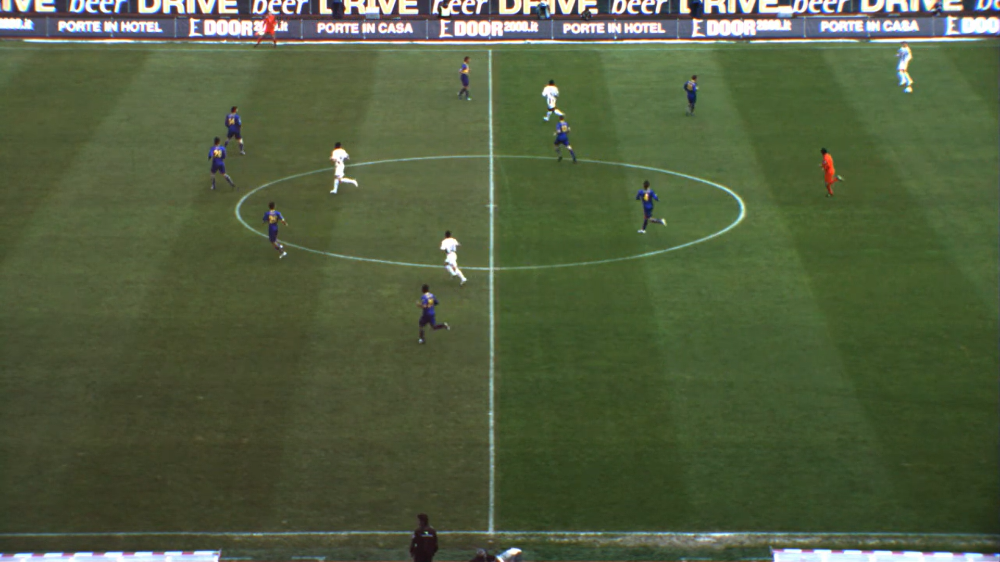
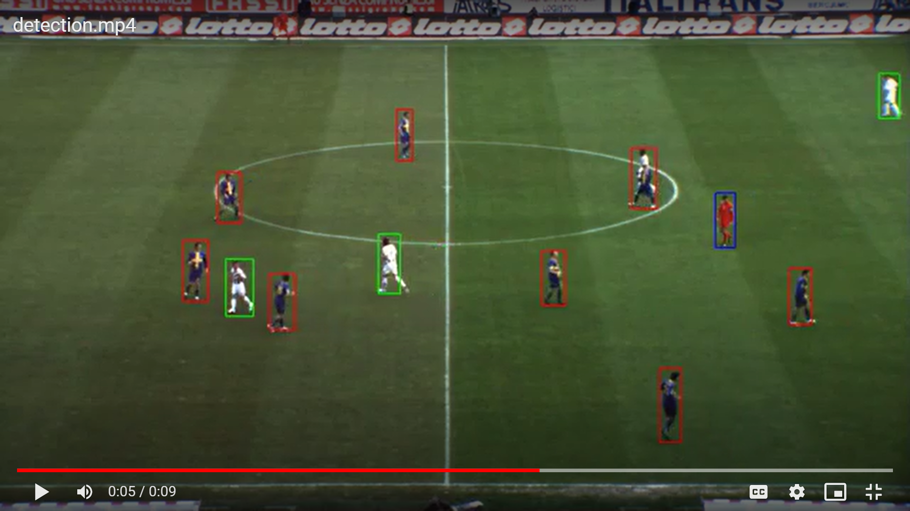
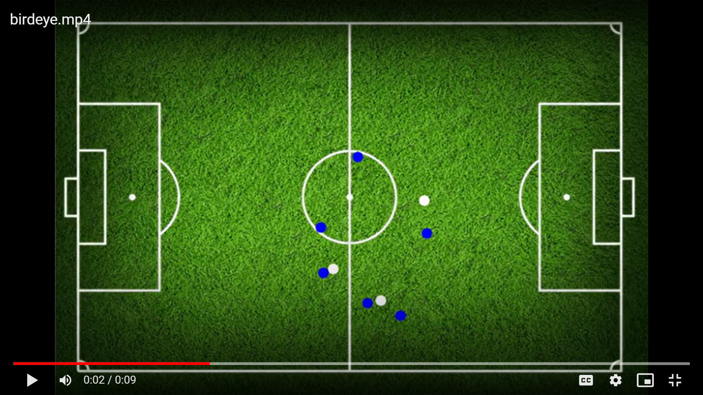
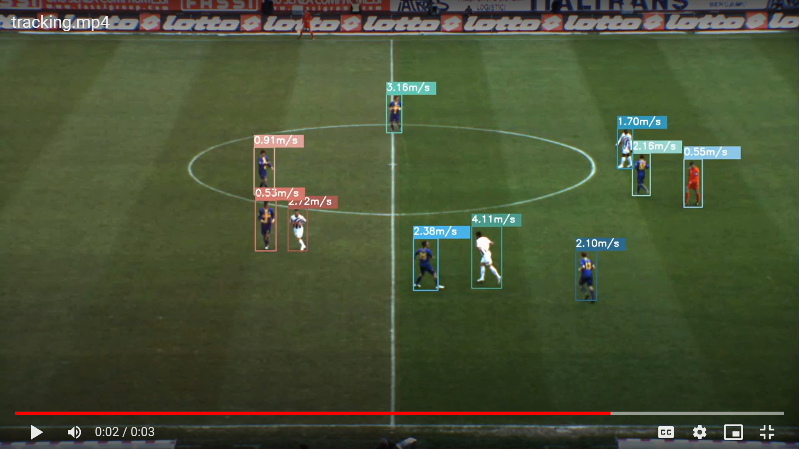

# SoccerNetPlus
# Introduction
## Technologies and Soccer
Advancements in technology are made each day and it’s no secret that these have been applied to various sports, and this includes soccer. Even though fans have different preferences and opinions towards the new types of technology involved in the game, nine times out of ten, technologies have proven to be extremely helpful and have assisted match officials in making the right call.

## Our Motivation
We are passionate about this project because we are interested in the usefulness and range of applications of tracking people in video, enhancing user experience with computer vision technologies, and improving people’s understanding of soccer.

## State of the Art
Yolo object detection model, OpenCV object detector, DeepSort object tracker

## Target Problems
1. How can we help people to better understand soccer games, especially the new fans?
2. How to make people’s life easier while enjoying the beauty of computer vision?

## Importance
Soccer is one of the world’s most popular sports. As a result, the revenues associated with the sport are astronomical. Improvements to the way fans view soccer have the potential to increase revenues, affect the way billions of people enjoy the sport, and attract even more people to the sport. Utilizing a player detection and camera calibration model in unison could be used in scenarios such as auto-generating highlights, improving live graphics, and strategy analysis. Successfully recreating such a system would be rewarding both technically and personally because of our passion for soccer.

# Approach
## Input:
[Sample Input Video](https://youtu.be/ta-M_RIHyFA)  

## Pipeline

## Implementation
### Backend

### Frontend

## Obstacles

## Outcome:
[Sample Output Video](_________________________________________)  

# Analysis
## Creativity
* Developer Perspective:
  * Eliminate the hardware restrictions (NVIDIA GPU)
  * Interaction with the model is more portable, as the model’s inputs and outputs will be online resources. Specifically, the inputs will be handpicked videos available in Google Drive or user-chosen YouTube videos. Output will be saved in Google Drive, available to any user with access to the folder
  * Easier to collaborate with the use of Colab
  * Provide detection with additional markings on the original video for people’s reference
  * Provide 2D birds-eye spotting, which could be especially useful for analyzing gameplay, such as when a possible offside happens
  * Provide analysis on different players, and statistics display 
* User Perspective:
  * Easier to use – don’t need to have any CS background
  * More accessible – as long as they have a Google account, they could use this app
  * More interactive with our UI presented
  * Could directly use a YouTube link to get analysis, so they don’t even need to know how to transform the video to be used by the model
  * Could directly see the statistics of the players

## Possible Improvements

## Comparisons with SoccerNet(?)

# Further Discussion
## Learnings

## Future Work

# Resources
## How To Run This Project Yourself
### With our [UI](https://kssn3t627cdj22bl.anvil.app/RESLVSCIHCHAY4EEBPRQ6EX3)
### With our source codes:

### Set up locally:
1. clone [our github repo](https://github.com/AJ-Wuu/SoccerNetPlus) to your computer
2. download official pretrained weights from [here](https://pjreddie.com/media/files/yolov3.weights), and put `yolov3.weights` under `yolov3_opencv/models` and `yolov3_deepsort/weights`
3. get the [test video](https://github.com/AJ-Wuu/SoccerNetPlus/blob/main/video_input/README.md)
4. Anvil _______________________________________________________

## References
1. Database: [ISSIA Dataset](https://issasports.com/appv1)
2. Paper: [Camera Calibration and Player Localization in SoccerNet-v2 and Investigation of their Representations for Action Spotting](https://openaccess.thecvf.com/content/CVPR2021W/CVSports/papers/Cioppa_Camera_Calibration_and_Player_Localization_in_SoccerNet-v2_and_Investigation_of_CVPRW_2021_paper.pdf)
3. Online Tutorial: [TowardsDataScience](https://towardsdatascience.com/how-to-track-football-players-using-yolo-sort-and-opencv-6c58f71120b8)
4. Pretrained Model: [Yolo-v3 by Joseph Chet Redmon](https://pjreddie.com/)
5. Open Source Project: [The AI Guy](https://github.com/theAIGuysCode)
