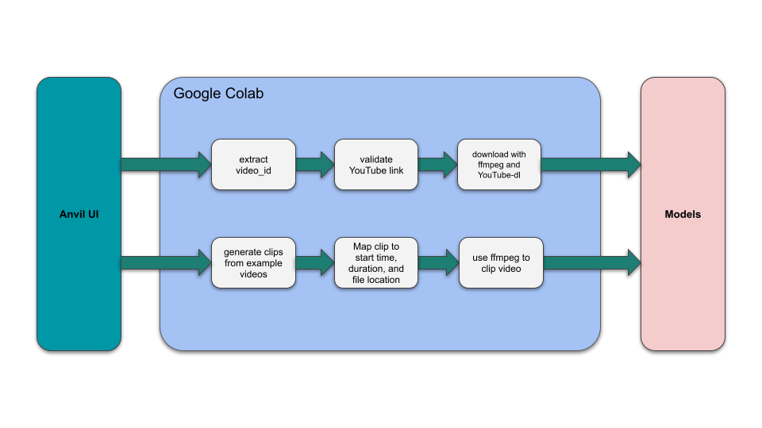

# Introduction
## Motivation
Soccer is perhaps the world’s most popular sport. As a result, the revenues associated with the sport are astronomical. Improvements to the way fans view soccer have the potential to increase revenues, affect the way billions of people enjoy the sport, and attract even more people to the sport. Computer vision models could be utilized in scenarios such as auto-generating highlights, improving live graphics, and strategy analysis. Successfully recreating such a system would be rewarding both technically and personally because of our passion for soccer.

## The Role of Technology in Soccer
As technology evolves, so does the world of sports. The ongoing World Cup has showcased new technologies. Relatively new technologies such as [AI improvements to Video Assistant Referee (VAR)](https://www.youtube.com/watch?v=C164kYMGV1A) and [soccer balls with built in sensors](https://fivethirtyeight.com/features/the-world-cups-new-high-tech-ball-will-change-soccer-forever/) are being utilized. With such a large amount of money at stake, there will certainly be more innovation to come in sports technology. 
## State of the Art
We use YOLO-v3, OpenCV and DeepSort in this project. YOLO (You Only Look Once) is one of the most popular series of object detection models. Its advantage has been in providing real-time detections while approaching the accuracy of state-of-the-art object detection models. OpenCV is extensively used in the field. It has a bunch of built-in functions to perform various computer vision activities. It helps with processing the video, generating coordinates and adding annotations to the original video with the result of detection. DeepSort computes the bounding boxes around the objects in the videos. It has a very cool algorithm with an identification model and estimated tracks.

### SoccerNet
This project is based on [action spotting and localization with SoccerNet-v2](https://openaccess.thecvf.com/content/CVPR2021W/CVSports/papers/Cioppa_Camera_Calibration_and_Player_Localization_in_SoccerNet-v2_and_Investigation_of_CVPRW_2021_paper.pdf). SoccerNet includes a “large-scale dataset for soccer video understanding” as well as benchmarks, and a model is discussed in the published paper. We initially planned on re-implementing and improving SoccerNet, but due to the timeframe of the course and feedback from the course instructors, we decided to focus on recreating aspects of SoccerNet using OpenCV, YOLOv3, and DeepSort. 
## Target Problems
1. How can we use computer vision to help people to better understand soccer games, especially the new fans?
2. How can we make it easier for people to enjoy the beauty of computer vision in the context of Soccer without requiring vast amounts of technical knowledge?

# Approach
## Addressing Target Problems
1. Utilize state of the art computer vision models to detect and highlight players, provide player statistics, and generate a top-down view from a side angle video
2. Create a straightforward user interface for the computer vision models which allows non-technical users to enjoy player detection and tracking to soccer video clips. 
## Sample Input: [Input Video](https://youtu.be/ta-M_RIHyFA)

## Pipeline

## User Interface

## Implementation
### User Interface
The frontend was developed using Anvil, which is a Python based web-app builder. Anvil was chosen due to its Python-based approach and its relative ease to set up. The Anvil UI contains some simple code for UI updates, basic input parsing, and making calls to our backend stored in a Google Colab notebook. In regards to the UI, the code calls the relevant backend functions and displays a progress update on success, or an error message on failure. 

### Backend Code
The “Example Video” dropdown menu is dynamically populated with clips by splitting the videos in the “video_input” folder by the “max_allowed_video_length” variable. __This implementation allows us to be able to quickly add or adjust example videos that are provided to users__. At this stage, “splitting” the video entails iterating over each video in “video_input” and adding an entry in a dictionary with “Clip n” as the key, where n is the clip number. The value associated with each clip is a dictionary containing entries for the video name, path of the original video, duration of the clip, and the start point for the clip in the original video.

Additionally, if a YouTube link is entered, the video ID is extracted, then it is validated using a request to YouTube’s endpoint for embedding videos and checking the return code.

Once a video clip or a valid YouTube video has been selected, FFmpeg is used to download the video. YouTube-dl is used in conjunction with FFmpeg to download from YouTube. In the case of an example video being selected, FFmpeg is used to merely “clip” the video based on the selected clip’s start time and duration. If this specific clip already exists in the “downloaded_videos” folder, the FFmpeg command is not run and the cached clip is used instead. Once a video clip has been created, the models can now be called using this clip as an input.
### Models
The code for the models starts with a video input of fixed angle. Within our code, we split into two branches corresponding to two functionalities: 2D transformation and tracking.
Within the first branch, specifically for detection and transformation, we get started with a pretrained model to find the players and mark them based on their teams. Then we use their positions on each frame to directly map onto a digital field. Therefore, we have the final bird-eye view ready.
In the second branch, we do tracking and statistics calculation. This time, we recognize the players as individuals, which is different from the previous one. For each player, we record their positions between two consecutive frames, and we use the time and distance to calculate their instant speed.
## Obstacles

1. Finding the best approach to organizing all of our code. We started with writing all of the code in our Google Colab jupyter notebook, which made it messy and hard to run along with the frontend. Hence, we moved the model code into separate python files with driver functions that can call the models based on the user’s selections.
2. Deciding how to arrange the different functionality of our program: detection, transformation and tracking. Although it is possible to combine all three functions into one big program, it does take quite a while to finish running. This led us to split them into two smaller model calls, which let the user decide what they would like as the output. Time to completion is nearly halved if a user only needs one of the possible output options.
3. Using FFmpeg to download or clip videos. Figuring out the flags we needed in the console command, and which order of the flags resulted in the best performance, took a lot of research and trial and error.

## Outcome
|Original|Birdeye|Detection|Tracking|
| ----------- | ----------- | ----------- | ----------- |
| |  | | |

### [Final Video](https://youtu.be/nknLKGR8ZgM)

# Analysis
## Creativity
* Developer Perspective:
* Eliminate the hardware restrictions (NVIDIA GPU).
* Easier to collaborate for further development with the use of Colab.
* Interaction with the model is more portable, as the model’s inputs and outputs will be online resources. Specifically, the inputs will be handpicked videos available in Google Drive or user-chosen YouTube videos. Output will be saved in Google Drive, available to any user with access to the folder.
* User Perspective:
* Easy to use – only a few settings need to be modified, and users don’t need to have any CS background or knowledge about computer vision.
* More accessible – as long as users have a Google account, they could use this app.
* More interactive with our UI presented compared to terminal commands.

## Possible Improvements
Let the users point-to-point match a screenshot of the video to the digital field for birdseye transformation.
Display a link in the frontend to directly download the output videos.
Allow users to choose from more options and statistics to be output

# Further Discussion
## Learnings
New technologies such as OpenCV, YOLOv3, DeepSort, Anvil
Became more comfortable reading technical papers
Connecting large amounts of code to work together seamlessly 

## Future Working Directions
Implement more detailed recognition to match the player on the field with their name and number.
Generate more statistics based on the video, like the ball possession statistics.
Make predictions – like where the ball is going to land and which player may take the possession.

# Resources
## Project Materials
[Project Proposal](https://github.com/AJ-Wuu/SoccerNetPlus/blob/e921a7dc37e40a3adde34b836b4566f8b5bf3f8a/resources/reports/Proposal.pdf)
[Midterm Report](https://github.com/AJ-Wuu/SoccerNetPlus/blob/e921a7dc37e40a3adde34b836b4566f8b5bf3f8a/resources/reports/Midterm%20Report.pdf)
[Final Slides](https://docs.google.com/presentation/d/1PVnrJJqY1PtrSmgknihM4s7R2XX_8XDHUd-9unMRtAM/edit?usp=sharing)
[Final Video](https://youtu.be/nknLKGR8ZgM)
[Github Page](https://github.com/AJ-Wuu/SoccerNetPlus)
## How To Run This Project Yourself
#### With our source code:

### Set up locally:
1. clone or download [our github repo](https://github.com/AJ-Wuu/SoccerNetPlus) to your computer
2. download the official pretrained weights from [here](https://pjreddie.com/media/files/yolov3.weights), and put `yolov3.weights` under `yolov3_opencv/models` and `yolov3_deepsort/weights`
3. get the [test video](https://github.com/AJ-Wuu/SoccerNetPlus/blob/main/video_input/README.md)
4. To make your own copy of the frontend, make an Anvil account and [follow this link](https://anvil.works/build#clone:KSSN3T627CDJ22BL=2KZ5MUAHG2GNGKAA2MEKC3EW). Once the Jupyter notebook is cloned, it can be run locally by embedding it in an html.
5. Connect the frontend and backend code by running the SoccerNetPlus.ipynb jupyter notebook and setting the relevant directory locations in the first block of the notebook

## References
1. ISSIA. *ISSA Sports Database*, 2022, https://issasports.com/appv1.
2. Cioppa, A., et al. “Camera Calibration and Player Localization in SoccerNet-v2 and Investigation of their Representations for Action Spotting.” *SoccerNet*, 2021, https://openaccess.thecvf.com/content/CVPR2021W/CVSports/papers/Cioppa_Camera_Calibration_and_Player_Localization_in_SoccerNet-v2_and_Investigation_of_CVPRW_2021_paper.pdf.
3. K, C. “How to Track Football Players Using Yolo, Sort and OpenCV.” *Towards Data Science*, https://towardsdatascience.com/how-to-track-football-players-using-yolo-sort-and-opencv-6c58f71120b8.
4. Redmon, Joseph. *YOLO-v3*, University of Washington, 2018, https://pjreddie.com/.
5. The AI Guy. https://github.com/theAIGuysCode.

